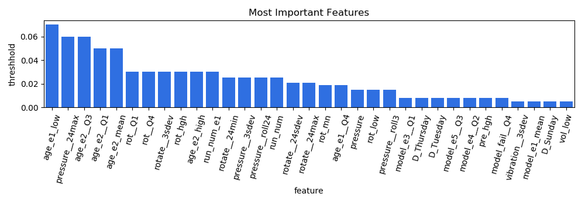
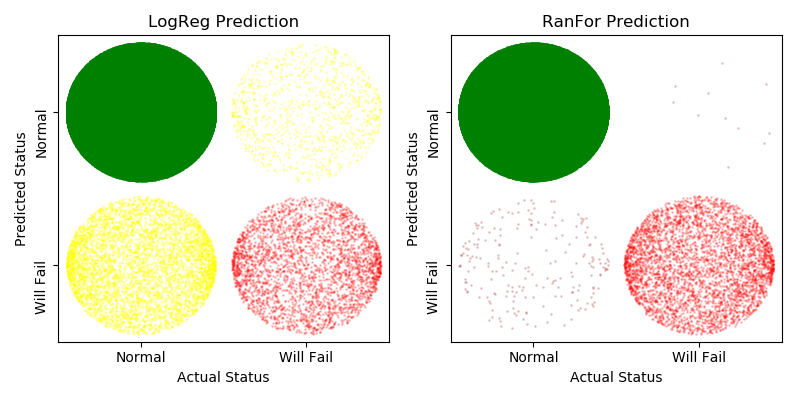
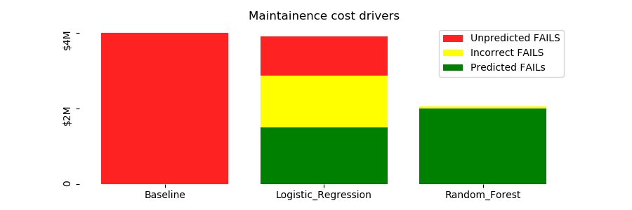

# Machine-Maintainence

This dataset consists of 100 machines with sensors and error codes timestamped across a period of one year.  The notebook shows all cleaning steps required (synchronizing the time references, converting data types, addressing missing values, etc.), dealing with the unbalanced nature of the data, visual data exploration, and finally, the creation and evaluation of two models.

The evaluation is done based on estimated repair costs (including actual repair, lost production, and unnecessary service calls.)  The results are detailed the  but the best model is projected to save almost 50% of the annual maintenance cost.

Though these plots show the relative accuracy in terms of predicting when machines fail, to understand the economic impact, the various quadrants of the confusion matrix must be weighted by the appropriate costs.  The results are surprising, as the logistic regression model is essentially useless, while the random forest is exceptionally useful.

In this repository, you will find:

  * jupyter notebook with all code, including that required to gather the data files from the original Microsoft project site.

  * powerpoint presentation that summarizes the data and results (in both ppt and pdf formats.  PDF can be viewed on this site.)

  * data and plot directories (updated)
